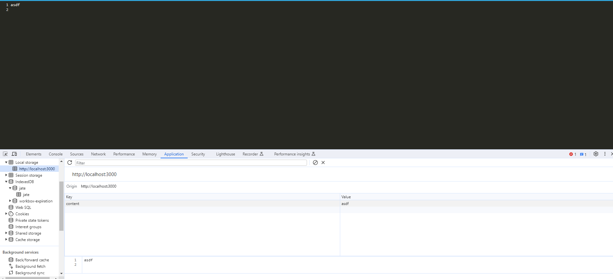
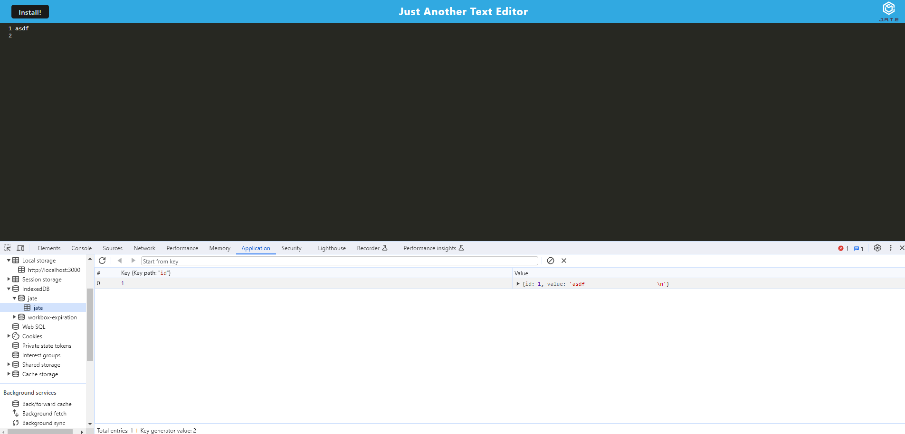
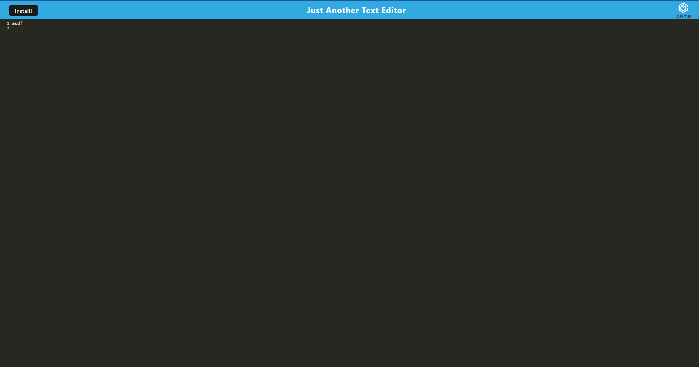

# 19 Progressive Web Applications (PWA): Text Editor

## Description
User will be able to view and interact with a text editor. Upon first visitng the site, user will be greeted with the text editor header. User then can type into the editor and see the contents of what was typed within the local storage as well as the index db. If user clicks off of the page, the content is still stored within the local storage and indexdb. If user completely closes the website, the contents will still remain on the page. User will be able to also install the app and use it just as they would on the website from their desktop.

## Contributors
George - TA

## Screenshots

## Links
Github: https://github.com/Ali-Aldawoodi/Browser-text-editor
Deployed: https://browser-text-editor99-1500ecf83ac7.herokuapp.com/

